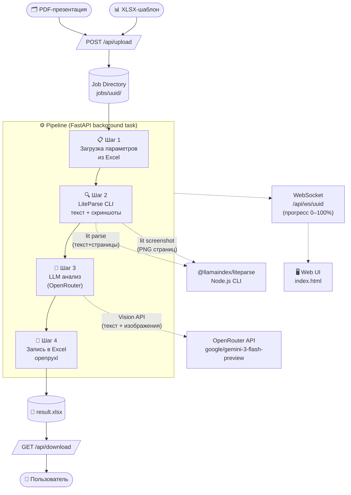
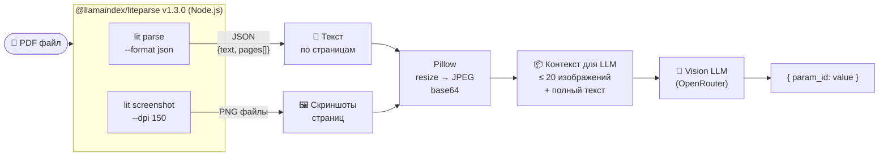
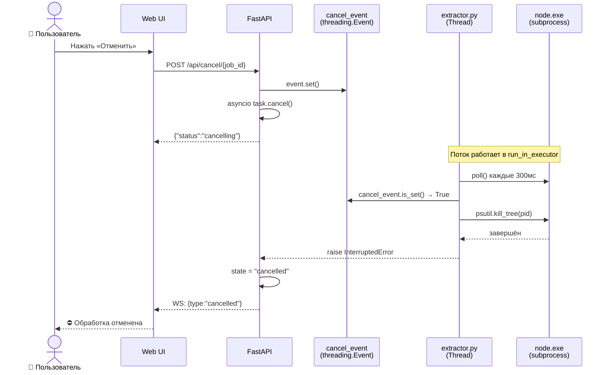

# PDF Concept Parser — Техническая документация

> Сервис автоматического извлечения параметров из PDF-презентаций девелоперских проектов
> и структурированной записи в Excel-таблицу.

---

## Содержание

1. [Назначение системы](#1-назначение-системы)
2. [Технологический стек](#2-технологический-стек)
3. [LiteParse — ключевая технология](#3-liteparse--ключевая-технология)
4. [Архитектура и поток данных](#4-архитектура-и-поток-данных)
5. [Обработка отмены](#5-обработка-отмены)
6. [API-интерфейс](#6-api-интерфейс)
7. [Качество извлечения](#7-качество-извлечения)
8. [Запуск и конфигурация](#8-запуск-и-конфигурация)

---

## 1. Назначение системы

Система решает задачу структурированного извлечения данных из PDF-презентаций
концепций жилой застройки (ТЭП, характеристики объекта, инфраструктура) и их
записи в единую сравнительную таблицу Excel.

**Входные данные:**
- PDF-файл — презентация объекта (слайды, инфографика, таблицы, схемы)
- XLSX-шаблон — файл с листом «параметры по концепциям» и листом «Список параметров»

**Результат:**
- Тот же XLSX-файл с новым столбцом, заполненным извлечёнными значениями

---

## 2. Технологический стек

### Backend

| Компонент | Технология | Версия | Роль |
|-----------|-----------|--------|------|
| Web-фреймворк | **FastAPI** | 0.135.2 | REST API + WebSocket |
| ASGI-сервер | **Uvicorn** | 0.42.0 | Запуск приложения |
| Валидация данных | **Pydantic** | 2.12.5 | Модели запросов/ответов |
| Async I/O | **aiofiles** | 25.1.0 | Асинхронная работа с файлами |

### PDF-обработка

| Компонент | Технология | Версия | Роль |
|-----------|-----------|--------|------|
| CLI-парсер | **@llamaindex/liteparse** | 1.3.0 | Текст + скриншоты страниц |
| Runtime | **Node.js** | 24.13.1 | Выполнение LiteParse CLI |
| Python-обёртка | **liteparse** (pip) | 1.1.0 | Python API над CLI |
| Обработка изображений | **Pillow** | 12.1.1 | Ресайз PNG → JPEG/base64 |

### LLM / AI

| Компонент | Технология | Версия | Роль |
|-----------|-----------|--------|------|
| LLM-клиент | **openai** SDK | 2.30.0 | OpenAI-совместимый клиент |
| LLM-роутер | **OpenRouter** | API | Доступ к множеству моделей |
| Модель по умолчанию | **google/gemini-3-flash-preview** | — | Vision + Text анализ |

### Excel

| Компонент | Технология | Версия | Роль |
|-----------|-----------|--------|------|
| Чтение/запись XLSX | **openpyxl** | 3.1.5 | Работа с Excel без Office |

### Системные утилиты

| Компонент | Технология | Версия | Роль |
|-----------|-----------|--------|------|
| Kill-tree процессов | **psutil** | 7.2.2 | Надёжная отмена subprocess |
| Переменные окружения | **python-dotenv** | 1.2.2 | Конфигурация через `.env` |

### Frontend

| Компонент | Технология | Роль |
|-----------|-----------|------|
| UI | Vanilla HTML/CSS/JS | Единый файл `static/index.html` |
| Обновления прогресса | **WebSocket** | Realtime прогресс-бар 0–100% |
| Зависимости | Нет | Zero-dependency frontend |

---

## 3. LiteParse — ключевая технология

### Что такое LiteParse

**LiteParse** (`@llamaindex/liteparse`) — открытый инструмент от команды
[LlamaIndex](https://github.com/run-llama/liteparse) для извлечения контента
из PDF-файлов. Реализован на **Node.js**, распространяется через npm,
предоставляет как CLI-интерфейс, так и Python-обёртку.

```
npm install -g @llamaindex/liteparse
pip install liteparse
```

### Два режима работы

#### `lit parse` — текстовое извлечение

```bash
lit parse document.pdf --format json
```

Возвращает структурированный JSON:

```json
{
  "text": "весь текст документа",
  "pages": [
    { "page": 1, "text": "текст первой страницы" },
    { "page": 2, "text": "текст второй страницы" }
  ]
}
```

**Применение в проекте:** дополнительный контекст для LLM.
Для сканированных PDF (без текстового слоя) возвращает пустой текст —
система автоматически переходит в режим «только скриншоты».

#### `lit screenshot` — визуальное извлечение

```bash
lit screenshot document.pdf -o ./output --dpi 150
```

Рендерит каждую страницу PDF как PNG-изображение с заданным DPI.
Это **основной источник данных** для Vision-моделей, поскольку:
- Таблицы, инфографика и схемы сохраняют исходный вид
- Сканированные документы полностью поддерживаются
- Данные из graphical layouts не теряются при текстовом парсинге

### Почему LiteParse, а не альтернативы

| Критерий | LiteParse | PyMuPDF | pdfplumber | Adobe PDF API |
|----------|-----------|---------|------------|---------------|
| Скриншоты страниц | ✅ Встроено | ✅ Встроено | ❌ Нет | ✅ Платно |
| Структурный JSON | ✅ | ❌ | ✅ Частично | ✅ |
| Open Source | ✅ MIT | ✅ AGPL | ✅ MIT | ❌ |
| Сканированные PDF | ✅ (скриншоты) | ✅ | ❌ | ✅ |
| Zero Python-deps | ✅ Node.js CLI | ❌ | ❌ | ❌ |
| Интеграция с LlamaIndex | ✅ Нативная | ❌ | ❌ | ❌ |

**Ключевое преимущество:** единый инструмент даёт одновременно текст И
визуальное представление страниц, что критично для документов с инфографикой
и таблицами, которые плохо извлекаются текстовыми парсерами.

### Обработка изображений после LiteParse

```
PNG (150 DPI) → Pillow resize (max 1024px) → JPEG quality=85 → base64
```

Пайплайн Pillow сокращает размер изображений в **5–10x** без потери читаемости,
что позволяет передавать до 20 страниц в одном LLM-запросе.

---

## 4. Архитектура и поток данных

### Общий пайплайн



### Детальная схема LiteParse → LLM



### Структура файлов проекта

```
pdf_parser/
├── api.py              # FastAPI приложение, WebSocket, job management
├── extractor.py        # LiteParse CLI wrapper, kill-tree, cancel support
├── llm_extractor.py    # OpenRouter клиент, batching, промпт
├── excel_handler.py    # Чтение параметров и запись результатов в XLSX
├── main.py             # CLI точка входа
├── static/
│   └── index.html      # Весь frontend (single-file, zero-deps)
├── requirements.txt
├── .env.example
└── jobs/               # Runtime: per-job директории (gitignored)
    └── {uuid}/
        ├── input.pdf
        ├── template.xlsx
        ├── status.json
        └── result.xlsx
```

---

## 5. Обработка отмены

### Проблема: subprocess на Windows

Стандартный `subprocess.run(timeout=N)` с `shell=True` на Windows
создаёт цепочку `python → cmd.exe → lit.cmd → node.exe`.
При истечении таймаута Python убивает только `cmd.exe`, а `node.exe` продолжает
работать, удерживая ресурсы.

### Решение: psutil kill tree + threading.Event



**Механизм:**
1. `threading.Event` — мгновенный сигнал отмены для блокирующего потока
2. `psutil.Process(pid).children(recursive=True)` — обход всего дерева потомков
3. `Popen + communicate()` в daemon-thread — исключает deadlock при переполнении PIPE-буфера
4. Точки отмены: между `lit parse` и `lit screenshot`, перед каждым LLM-батчем

---

## 6. API-интерфейс

| Метод | Путь | Описание |
|-------|------|----------|
| `POST` | `/api/upload` | Загрузка PDF + XLSX, возвращает `job_id` |
| `POST` | `/api/process/{job_id}` | Запуск пайплайна (с опциональным кастомным промптом) |
| `POST` | `/api/cancel/{job_id}` | Немедленная отмена обработки |
| `GET` | `/api/status/{job_id}` | Текущий статус задания |
| `GET` | `/api/download/{job_id}` | Скачать result.xlsx |
| `WS` | `/api/ws/{job_id}` | WebSocket: realtime прогресс и логи |
| `GET` | `/api/prompt` | Получить/просмотреть текущий системный промпт |

### WebSocket сообщения

```json
{ "type": "log",       "message": "🔍 Извлекаем данные...", "progress": 15 }
{ "type": "status",    "data": { "state": "running", "progress": 40 } }
{ "type": "done",      "data": { "found": 26, "total": 37, "results": [...] } }
{ "type": "cancelled", "message": "⛔ Обработка отменена пользователем" }
{ "type": "error",     "message": "❌ Ошибка: ...", "traceback": "..." }
```

---

## 7. Качество извлечения

### Тестирование на эталонных данных

Система протестирована на двух PDF-презентациях с верификацией по эталонному
столбцу Excel (ручное заполнение аналитиком).

| PDF | Страниц | Время | Найдено | Корректно (семантически) |
|-----|---------|-------|---------|--------------------------|
| ГК Концепция 6 (слайды 18) | 48 | ~30 сек | 26/37 (70%) | ~90% |
| Дмитров — ЖК Большевик 2 | 20 | ~52 сек | 20/37 (54%) | ~88% |

> Сканированный PDF (без текстового слоя) — анализ только по скриншотам.

### Почему остаток ~10% не совпадает

Расхождения обусловлены **неоднозначностью эталона**, а не ошибками модели:

- **Падеж существительного** — «Многоквартирная» vs «Многоквартирной» (оба верны)
- **Формат числа** — `48 604 м²` vs `48604 м2` (одно значение)
- **Выбор из нескольких** — для паркинга в PDF нет строки «итого», аналитик выбрал одно значение из разбивки по корпусам
- **Метрика ДОО/СОШ** — эталон содержит «мест», PDF содержит также «детей» и «м²»

### Поддерживаемые модели

Система работает с любой Vision-capable моделью через OpenRouter:

| Модель | Скорость | Качество | Рекомендация |
|--------|----------|----------|--------------|
| `google/gemini-3-flash-preview` | ~30 сек | ★★★★☆ | **По умолчанию** |
| `google/gemini-3.1-pro-preview` | ~165 сек | ★★★★☆ | Не оправдывает скорость |
| `openai/gpt-4o` | ~60 сек | ★★★★★ | Резервная |
| `anthropic/claude-sonnet-4-6` | ~45 сек | ★★★★★ | Резервная |

---

## 8. Запуск и конфигурация

### Требования

- Python 3.11+
- Node.js 18+ и npm

### Установка

```bash
# 1. Зависимости Python
python -m venv .venv
.venv\Scripts\activate          # Windows
pip install -r requirements.txt

# 2. LiteParse CLI
npm install -g @llamaindex/liteparse

# 3. Конфигурация
cp .env.example .env
# Заполнить OPENROUTER_API_KEY в .env
```

### Запуск сервера

```bash
python api.py
# Сервер доступен на http://localhost:8000
```

### CLI-режим (без UI)

```bash
python main.py "презентация.pdf" "шаблон.xlsx"
python main.py "презентация.pdf" "шаблон.xlsx" --model openai/gpt-4o --dpi 200
```

### Переменные окружения

| Переменная | Описание | По умолчанию |
|-----------|----------|-------------|
| `OPENROUTER_API_KEY` | API-ключ OpenRouter | — (обязательно) |
| `OPENROUTER_MODEL` | ID модели | `google/gemini-3-flash-preview` |

---

## Лицензия и зависимости

| Пакет | Лицензия |
|-------|---------|
| FastAPI | MIT |
| @llamaindex/liteparse | MIT |
| openpyxl | MIT |
| Pillow | HPND |
| psutil | BSD-3 |
| openai SDK | MIT |

---

*Документация актуальна для версии коммита `b1fe3b7` · март 2026*
